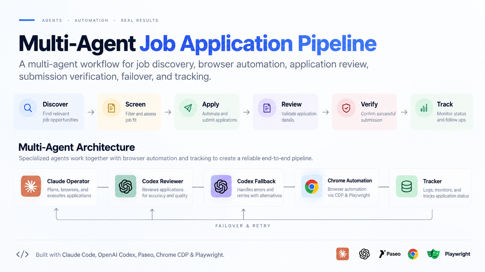
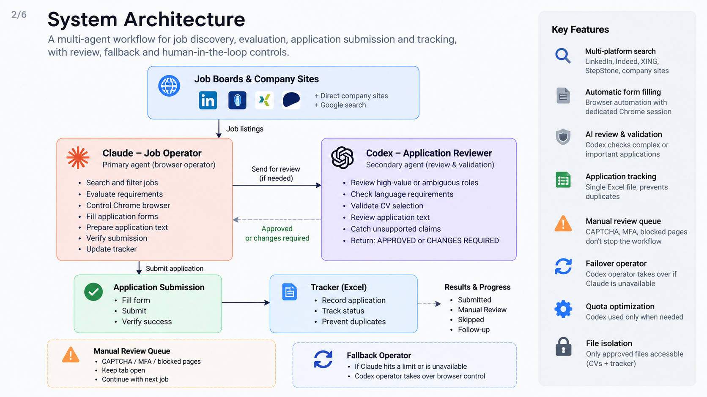
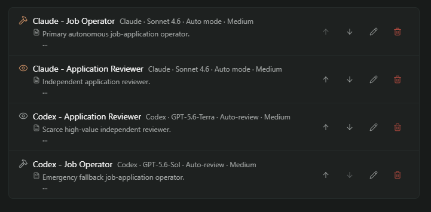

# Multi-Agent Job Application Pipeline

I’m currently looking for a Werkstudent / part-time / junior role in IT,
cybersecurity, or AI.

Instead of treating the repetitive parts of the job search as manual work,
I turned the process itself into an engineering project.

This repository documents a multi-agent workflow where AI agents cooperate to:

- discover relevant jobs
- evaluate requirements
- control a dedicated browser session
- fill application forms
- select the appropriate CV
- review higher-risk applications
- submit and verify applications
- track campaign state
- recover from model limits and browser blockers



## Architecture



The current design uses:

### Claude - Job Operator

The primary agent.

Responsibilities:

- job discovery
- vacancy screening
- Chrome/browser control
- application form filling
- CV selection
- application text preparation
- submission verification
- tracker updates
- manual-review queue management

### Codex - Application Reviewer

Used selectively for higher-value or ambiguous applications.

It checks:

- factual accuracy
- unsupported claims
- language requirements
- eligibility
- CV selection
- complex form answers
- recruiter outreach
- legal/work-authorization wording

It returns:

`APPROVED`

or

`CHANGES REQUIRED`

### Codex - Fallback Operator

If Claude becomes unavailable or hits a provider limit, a second operator can
take over the browser and continue from the existing tracker/browser state.

## Agents in Action



The operator and reviewer are kept separate so that the system has an
independent quality-control layer.

Only one operator controls the browser at a time.

## Workflow

```text
SEARCH
  ↓
SCREEN
  ↓
CHECK DUPLICATE
  ↓
SELECT CV
  ↓
FILL APPLICATION
  ↓
SELF-CHECK
  ↓
CODEX REVIEW IF NEEDED
  ↓
SUBMIT
  ↓
VERIFY
  ↓
TRACK
  ↓
NEXT
