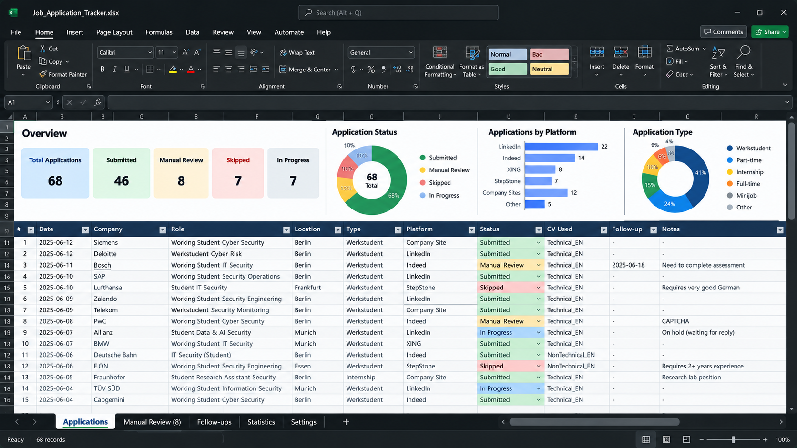

# Multi-Agent Job Application Pipeline

I’m currently looking for a **Werkstudent / part-time / junior role in IT, cybersecurity, or AI**.

Instead of treating the repetitive parts of the job search as manual work, I turned the process itself into an engineering project.

This repository documents a multi-agent workflow where AI agents cooperate to:

- discover relevant jobs
- evaluate requirements
- control a dedicated browser session
- fill application forms
- select the appropriate CV
- review higher-risk applications
- submit and verify applications
- track campaign state
- recover from model limits and browser blockers


> **Image note:** `Agents.png` is a real screenshot from my Paseo environment.  
> `IntroPage.png`, `Process Pipeline.png`, and `Excel.png` are illustrative visuals created to explain the architecture and workflow. They do not represent real employer data.

---

## Architecture


The current design uses four agent profiles:

### Claude - Job Operator

The primary operator.

Responsibilities:

- job discovery
- vacancy screening
- Chrome/browser control
- application form filling
- CV selection
- application text preparation
- submission verification
- tracker updates
- manual-review queue management
- selective escalation to an independent reviewer

### Claude - Application Reviewer

An optional second Claude perspective for cases where a separate review is useful without consuming Codex quota.

### Codex - Application Reviewer

Used selectively for higher-value or ambiguous applications.

It checks:

- factual accuracy
- unsupported claims
- language requirements
- eligibility
- CV selection
- complex form answers
- recruiter outreach
- legal/work-authorization wording
- salary or compensation questions

It returns:

```text
APPROVED
```

or:

```text
CHANGES REQUIRED:
- exact issue
- required correction
```

### Codex - Job Operator

Emergency fallback operator.

If the primary Claude operator becomes unavailable, rate-limited, or unable to continue, Codex can take over from the existing browser and tracker state.

Only **one operator** is allowed to control Chrome at a time.

---

## Real Agent Orchestration


Paseo is used to orchestrate the agents.

The main operator can:

- launch subagents
- send review tasks
- reuse persistent reviewer sessions
- keep a fallback operator available
- hand off work when another provider becomes unavailable

A key optimization is to **reuse persistent agents** rather than spawning a fresh reviewer for every application.

---

## Workflow

```text
SEARCH
  ↓
SCREEN
  ↓
CHECK DUPLICATE
  ↓
OPEN REAL VACANCY
  ↓
SELECT CV
  ↓
FILL APPLICATION
  ↓
SELF-CHECK
  ↓
CODEX REVIEW IF NEEDED
  ↓
SUBMIT
  ↓
VERIFY
  ↓
TRACK
  ↓
NEXT
```

Routine applications are handled with a Claude self-check.

Higher-value, ambiguous, legal, compensation-related, or technically complex applications can be escalated to Codex for independent review.

---

## Browser Automation

The operator uses a dedicated Chrome profile exposed through the Chrome DevTools Protocol (CDP).

Example:

```bash
google-chrome-stable \
  --user-data-dir="$HOME/chrome-job-automation" \
  --remote-debugging-port=9222
```

Verify:

```bash
curl -s http://localhost:9222/json/version
```

The operator connects to:

```text
http://localhost:9222
```

The dedicated profile keeps automation state separate from the user's normal browser profile.

---

## Application Tracking



The visual above is an illustrative tracker concept.

The real campaign uses a persistent tracker as its source of truth. Typical fields include:

- company
- role
- location
- application date
- application URL
- CV used
- submission channel
- status
- recruiter outreach
- manual-review blockers
- follow-up state

The tracker is more reliable than depending on an agent's conversational memory.

---

## Manual Review Queue

CAPTCHA, MFA, login verification, Cloudflare challenges, broken ATS controls, and similar manual-only steps do **not** stop the entire campaign.

Instead, the system:

1. stops work on that application only
2. preserves the tab and entered state where possible
3. moves the application into a **Manual Review** queue
4. records the blocker
5. continues with another opportunity

The system does **not** attempt to bypass CAPTCHA, MFA, or other platform security controls.

---

## Model Quota Optimization

A major design decision was to avoid using a second model on every application.

Routine path:

```text
Claude Operator
→ factual self-check
→ submit
```

High-value or ambiguous path:

```text
Claude Operator
→ Codex Reviewer
→ correction if needed
→ submit
```

This reduces duplicated token usage while keeping an independent quality-control layer where it matters most.

---

## Browser Ownership

Exactly one operator may manipulate Chrome at any time.

Normal state:

```text
Claude Operator → Chrome
```

Fallback state:

```text
Claude stops browser work
        ↓
Codex Operator takes ownership
```

Never:

```text
Claude + Codex → same Chrome session simultaneously
```

This avoids:

- conflicting clicks
- duplicate submissions
- corrupted forms
- accidental tab closure
- inconsistent browser state

---

## Failover

The system is designed around provider limits and runtime failures.

Normal:

```text
Claude Operator
→ Codex Reviewer when needed
```

If Claude becomes unavailable:

```text
Preserve browser + tracker state
        ↓
Codex Operator takes over
```

See [FAILOVER.md](FAILOVER.md) for the detailed handoff process.

---

## Security Model

Sensitive documents are isolated from the active agent workspace.

Agents are explicitly instructed not to access the `Private/` directory unless the user authorizes a specific file.

Never publish or commit:

- API keys
- browser cookies
- session tokens
- private CVs
- identity/residence documents
- home addresses
- phone numbers
- private recruiter information
- real application tracker data

See [SECURITY.md](SECURITY.md).

---

## Current Stack

- Claude Code
- OpenAI Codex
- Paseo
- Google Chrome
- Chrome DevTools Protocol
- Playwright
- Excel / XLSX tracker
- Linux / Kubuntu

---

## What I Learned

The hardest part was not getting an AI model to click buttons.

The more interesting engineering problems were:

- persistent state
- browser ownership
- retry logic
- model quota constraints
- independent review
- failover
- CAPTCHA/MFA handling
- duplicate prevention
- token-efficient agent communication
- sensitive-file isolation

See [LESSONS_LEARNED.md](LESSONS_LEARNED.md).

---

## Documentation

- [Setup Guide](SETUP.md)
- [Agent Configuration](AGENTS.md)
- [Architecture](ARCHITECTURE.md)
- [Failover Strategy](FAILOVER.md)
- [Security Model](SECURITY.md)
- [Lessons Learned](LESSONS_LEARNED.md)
- [Claude Job Operator Prompt](prompts/claude_job_operator.md)
- [Claude Application Reviewer Prompt](prompts/claude_application_reviewer.md)
- [Codex Application Reviewer Prompt](prompts/codex_application_reviewer.md)
- [Codex Job Operator Prompt](prompts/codex_job_operator.md)

---

## Future Improvements

Potential next steps:

- supervisor/heartbeat orchestration
- provider health checks
- structured application-state database
- better relevance scoring
- recruiter-response monitoring
- automated follow-up scheduling
- richer failure telemetry
- dashboard metrics
- containerized deployment

---

## Disclaimer

This repository documents a personal engineering experiment.

It does not attempt to bypass CAPTCHA, MFA, platform security controls, or employer restrictions.

Anyone adapting the workflow should respect:

- job-board terms
- employer policies
- privacy requirements
- rate limits
- applicable law
